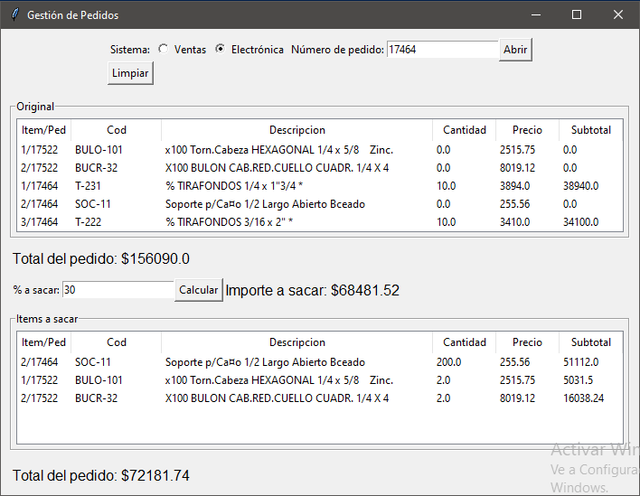
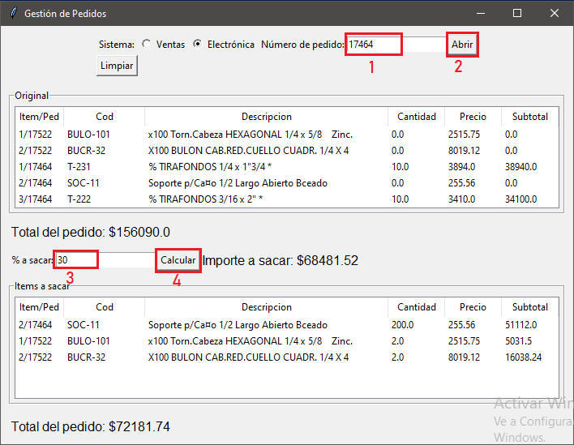

# Calcula importe

### Programa con interfaz grafica para cualcular un importe a sacar sobre un pedido del sistema de ventas.
### el objetivo es agilizar el proceso de facturacion calculando sobre el total del pedido calcular un porsentaje y quitar items del pedido hasta llegar al monto deseado.

## Como usarlo:

### ingrese el numero de pedido q desea calcular, puede ingresar todos los pedidos q dese, los totales se sumaran
### ingrese el porsentaje q desea sacar (ej:30%)
### apretar en el boton calcular.
### los items a sacar del pedido apareceran en una listasta ordenado segun el pedido

